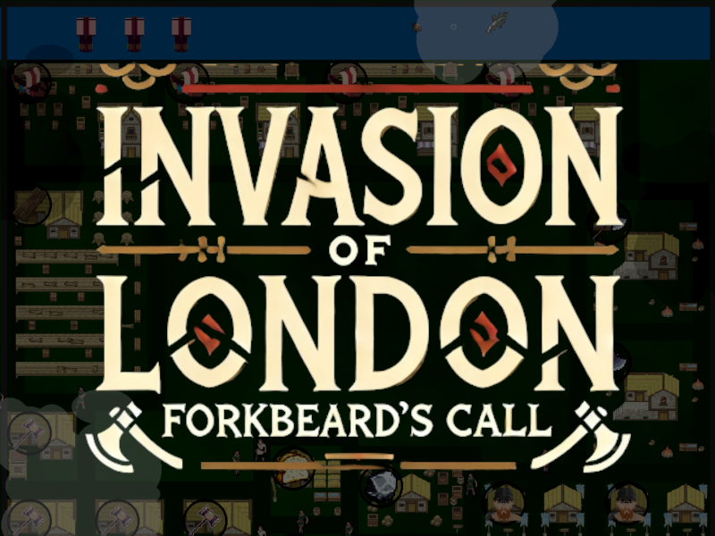
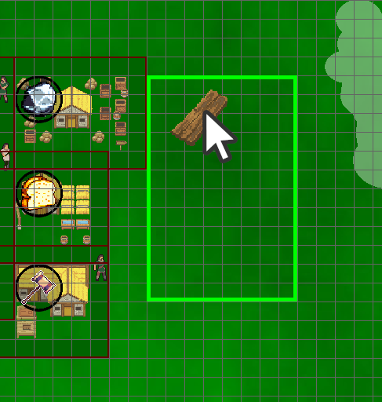

# Invasion of London: Forkbeard's Call

https://github.com/Elan456/viking-village-builder

## Table of Contents

- [Invasion of London: Forkbeard's Call](#invasion-of-london-forkbeards-call)
  - [Table of Contents](#table-of-contents)
  - [Setup instructions](#setup-instructions)
    - [1. Downloading the Game (If you don't already have it)](#1-downloading-the-game-if-you-dont-already-have-it)
      - [Using Git](#using-git)
      - [Downloading the ZIP](#downloading-the-zip)
    - [2. Dependency Installation](#2-dependency-installation)
    - [3. Running the game](#3-running-the-game)
  - [Gameplay Instructions](#gameplay-instructions)
    - [Objective](#objective)
    - [First Steps](#first-steps)
      - [Getting Raw Resources](#getting-raw-resources)
      - [Building More Buildings](#building-more-buildings)
      - [Advanced Resources](#advanced-resources)
    - [Controls](#controls)
    - [Win Condition](#win-condition)
    - [Building](#building)
    - [Turn Management](#turn-management)
    - [Resource Panel](#resource-panel)
    - [Crafting Dependencies](#crafting-dependencies)
  - [Credits](#credits)
    - [Programming](#programming)
    - [Music](#music)
    - [Art](#art)
    - [Tooling](#tooling)
  - [Milestone Feature Breakdown](#milestone-feature-breakdown)
    - [Final Project Milestone (11/21 - 12/9)](#final-project-milestone-1121---129)
      - [Notable Changes / Additions](#notable-changes--additions)
    - [Milestone 3 (10/31 - 11/20)](#milestone-3-1031---1120)
      - [Features Added (with Point Values Adding to 100)](#features-added-with-point-values-adding-to-100)
    - [Milestone 2 (9/17 - 10/30)](#milestone-2-917---1030)
      - [Features Added](#features-added)
---

## Setup instructions
Currently, the game is not packaged into an executable, so you will need to run it from the source code.

### 1. Downloading the Game (If you don't already have it)

#### Using Git
```sh
git clone https://github.com/Elan456/viking-village-builder.git
cd viking-village-builder
```

#### Downloading the ZIP

Visit the GitHub repository at [viking-village-builder](https://github.com/Elan456/viking-village-builder)

1. Click the green "Code" button on the top right of the repository
2. Click "Download ZIP"
3. Extract the ZIP to a folder

### 2. Dependency Installation

> Note: You may need to install Python 3.8 or higher to run the game. You can download it from https://www.python.org/downloads/

```sh
python -m pip install -r requirements.txt
```

This should install pygame and e-pyquadtree.

> e-pyquadtree is a quadtree data structure package written by me, check it out on GitHub: https://github.com/Elan456/pyquadtree

### 3. Running the game 

```sh
python main.py 
```

## Gameplay Instructions 

### Objective

Your village has been selected to aid in the invasion of London. By placing buildings and managing resources, you must build an army of 250 warriors and 10 ships by turn 100.

### First Steps 

#### Getting Raw Resources

1. Your village starts with a few buildings and a wall.
2. You need to start accumulating basic resources: wood , ore , and food  to craft weapons , warriors , and ships  later
3. Click and drag the lumberyard building from the right panel to an empty space within your walls.

1. The ghost of the building will appear with a number indicating how many turns are left until it is built. The orange outline indicates that the building is currently being worked on. 

#### Building More Buildings
1. With more builder's huts, you can build more buildings at once.
2. Click and drag the builder's hut from the right panel (hammer icon)  to an empty space within your walls.


#### Advanced Resources
The buildings which produce Aadvanced resources such as weapons, warriors, and ships can have their production boosted by other buildings.

1. Click and drag a blacksmith building (axe icon) to an empty space within your walls.
2. Notice the blue lines indicating which buildings boost the blacksmith's production.
3. The boost amount is a multiplier on the base production rate of the blacksmith based on its proximity to the boosting buildings.

### Controls

- "H" = Show Help Screen
- WASD / Arrow Keys / Middle-Click + Drag = Pan Camera
- Mouse for interacting with and placing buildings
- "N" to show the navigation mesh

### Win Condition
- To win, you must have 250 warriors and 10 ships on turn 100. 

### Building

Click + drag on a building from the far-right panel to an empty space within your walls.

If the construction fails, a message will appear in the center to tell you why.

Common reasons for construction failure are:
- Not enough resources
- Shipyard not along the river
- Outside of the wall
- Building overlaps with another building

### Turn Management

In the bottom-left corner there is a button to advance to the next turn. This will
trigger each building to produce and consume their respective resources.
Construction projects will advance and you might get a random event.

You only get 100 turns till the end of the game to build your army and prepare for the invasion.

### Resource Panel

The panel in the top-left corner shows your current resources and how much you are producing and consuming.
For the warriors and ships, a projection is shown to indicate how many you will have at the end of 100 turns assuming your current production rate stays the same. 
A resource will turn red if buildings are unable to produce because of a lack of that resource. This is a warning that you need to build more of that resource-producing building.

### Crafting Dependencies

Production | Cost / Boost Buildings
--- | ---
 | , 
 | , 
 | , 

## Credits

### Programming
Ethan Anderson (Elan456)

### Music
Written and composed by Love Springs

### Art
Font: [Oldenburg-Regular.ttf](https://www.1001fonts.com/oldenburg-font.html) by Nicole Fally  
Hammer Icon: [32x32 RPG Weapons Icons](https://antrixglow98.itch.io/32x32rpgweaponsicons) by AntrixGlow98  
Tree Assets: [Nature Trees](https://admurin.itch.io/nature-trees?download) by Admurin  
Fire Animation: [Pixel Fire](https://elska.itch.io/pixel-fire) by Elska  
Wood Icon: [Pixel Art Wood](https://frostwindz.itch.io/pixel-art-wood) by Frostwindz  
Ore Icon: [96 Total 32x32 Pixel Art Icons Ores Minerals Crystals](https://ancient-inscriptions.itch.io/96-total-32x32-pixel-art-icons-ores-minerals-crystals) by Ancient-Inscriptions  
Food Icon: [180 Total 32x32 Pixel Art Icons Food Fruit Veggies Meat Candy Bread Etc](https://ancient-inscriptions.itch.io/180-total-32x32-pixel-art-icons-food-fruit-veggies-meat-candy-bread-etc) by Ancient-Inscriptions  
Axe Icon: [32x32 RPG Weapons Icons](https://antrixglow98.itch.io/32x32rpgweaponsicons) by AntrixGlow98  
Warrior Icon: [Viking](https://dreamir.itch.io/viking) by Dreamir  
Ship Icon: [Pixel Art Viking Ship 16 Directions](https://helianthus-games.itch.io/pixel-art-viking-ship-16-directions) by Helianthus-Games  
Medieval Building Assets: [Medieval Fantasy RPG Tileset](https://ventilatore.itch.io/the-fantasy-tileset) by Ventilatore  

### Tooling
- [Pygame](https://www.pygame.org/news) for the game engine
- [e-pyquadtree](https://github.com/Elan456/pyquadtree) for the quadtree optimizations
- [Tiled](https://www.mapeditor.org/) for the map editor
- [GIMP](https://www.gimp.org/) for image editing
- [Audacity](https://www.audacityteam.org/) for audio editing
- [VS Code](https://code.visualstudio.com/) for code editing

## Milestone Feature Breakdown


### Final Project Milestone (11/21 - 12/9)

#### Notable Changes / Additions 
1. Add procedurally generated clouds that move 
2. Perlin noise background images
3. Fix deprived resource detection
4. Add a lore scroll
5. Fix leaves dropping at the wrong times
6. Change the river color to be more subtle
7. Add more int casting to prevent random.randint errors
8. Improve the paths / borders around the buildings
9. Put the building's icon on it's asset in the main screen, so it's easier to see what it is
10. Show the boost buildings when hovering over a building
11. Add a help screen (press H)
12. Add background music from Love Springs
13. Make the main resource panel much larger
14. Add red color when projection is less than the win condition


### Milestone 3 (10/31 - 11/20)

#### Features Added (with Point Values Adding to 100)
1. Add construction phases to buildings (7)
2. Move the resource panel to the top-left (2)
3. Have the builders walk to construction sites (4)
4. Add a builder assignment manager (7)
5. Show how many turns are needed for a building to be completed to the hover panel (3)
6. Add a button to upgrade the wall and show the cost to do so (3)
7. Indicate buildings that are too expensive with a red rectangle (3)
8. Add an "along river" check for shipyards (3)
9. Improve the contrast of announcements (2)
10. Have the background color change with the seasons (5)
11. Add debris that float down the river and ripples to make the river more lively (5)
12. Add trees that grow over time and the lumberjacks navigate to them (6)
13. Advance the villagers by a few updates each turn to indicate the passage of time (4)
14. Add building demolition, requires turns just like construction (4)
15. Draw all the building assets (10)
16. Fix some resource consumption and production bugs (3)
17. Add a win condition prediction calculation, so the player knows if they are on track (5)
18. Render boats on the river as more are built (3)
19. Make the boats sway in the water (3)
20. Render soldiers in a box as the army grows (4)
21. Add a fire random event that destroys buildings (5)
22. Add plague, caravan, and blight random events (5)
23. Add descriptions to the buildings' hover panel (3)
24. Improve the Linux resolution (2)
25. Add a more stylized button (2)
26. Add a start screen with a button to start the game (3)
27. Add a win/lose screen with stats (2)
28. Navmesh optimizations using an additional quadtree (5)
29. Resource text changes color if it's over demanded (2)
30. Building panel shows icons for the buildings instead of the building itself (2)
31. Change disable, enable, and demolish buttons to be more stylied (2)

### Milestone 2 (9/17 - 10/30)

[Link to the full changelog](https://github.com/Elan456/viking-village-builder/commits/0.1)

#### Features Added
- Random event skeleton
- Buttons
- Main panel (turn and resource display)
- Building panel (To drag and place buildings from)
- Building collision and placement
- Fully animated villagers (Idle + Walking)
- Villager pathfinding using A* algorithm, navigation mesh, and quadtree optimizations
- Ability to disable buildings
- Button to demolish buildings
- Placeholder building assets
- Full set of resource assets
- Resource production and consumption per building
- Resource production prediction algorithm
- Arrow key + WASD camera panning
- Middle-click + drag camera panning
- Villager speech bubbles
- Building definition file as a JSON with parsing
- Wall around the village
